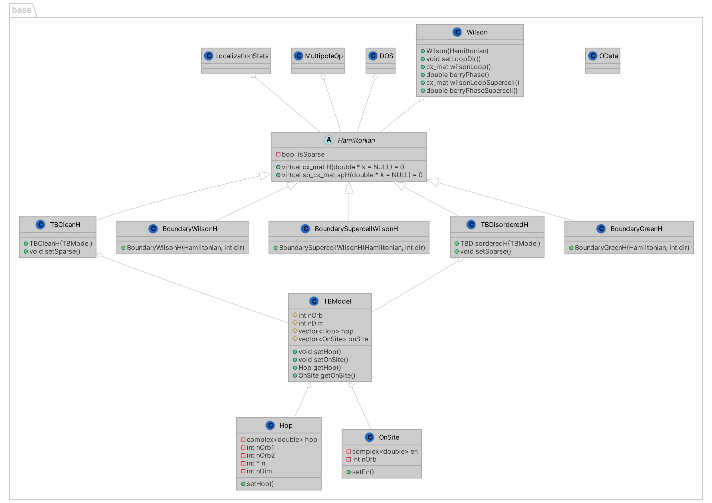

# TIM
Topological Insulator Models (TIM) provides C++ classes for tight-binding models of topological insulators.
This project was created to support my master's thesis, and it provides code for running the simulations that generate the data analyzed in our work:

**H Lóio, M Gonçalves, P Ribeiro, EV Castro,
"Third-order topological insulator induced by disorder", 
Physical Review B 109 (1), 014204.
DOI: https://doi.org/10.1103/PhysRevB.109.014204**

Please cite our paper if you use this code in your research.

## Dependencies

* [Armadillo](http://arma.sourceforge.net/)
* [Matplotlib](https://matplotlib.org/) - *Optional* - only for running the python plotting scritps in the `scripts/` folder.
* [Science Plots](https://github.com/garrettj403/SciencePlots) - *Optional* - only for running the python plotting scritps in the `scripts/` folder.

## Build

    mkdir build
    cd build
    cmake ..
    make

## Project class diagram

